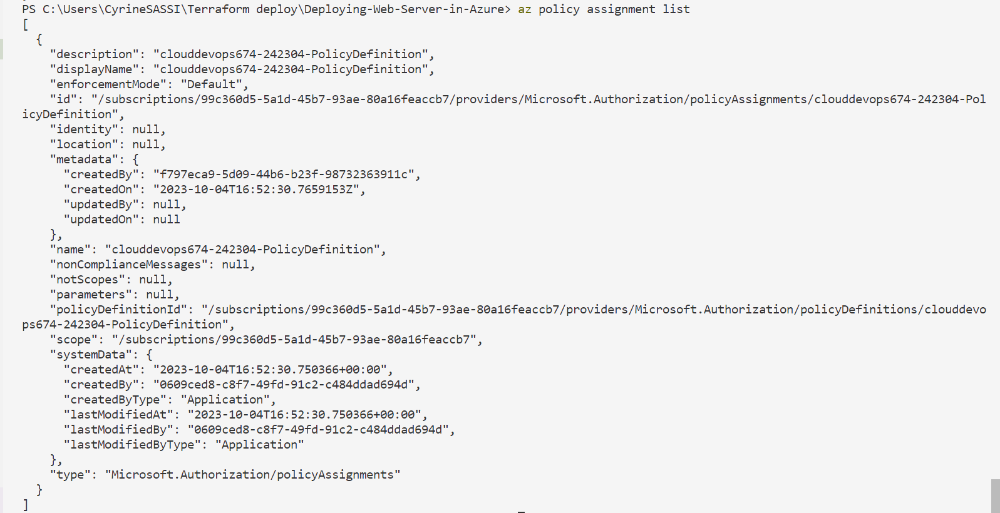
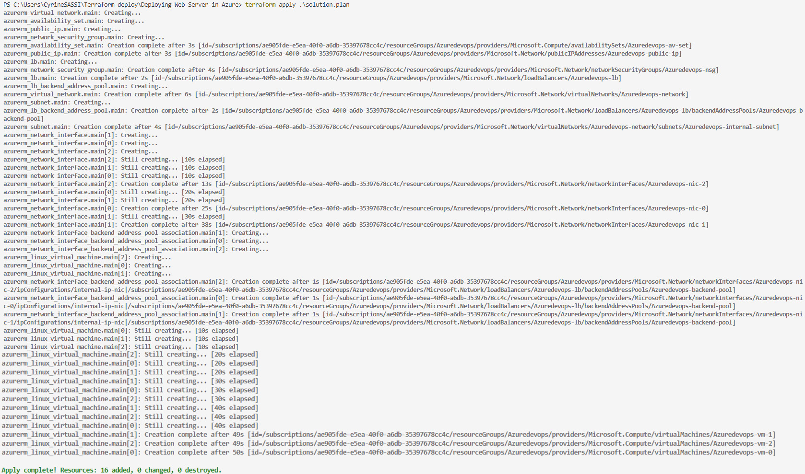

# Azure Infrastructure Operations Project: Deploying a scalable IaaS web server in Azure

## Introduction

For this project, you will write a Packer template and a Terraform template to deploy a customizable, scalable web server in Azure.

### Getting Started

1. Clone this repositories

2. Create your infrastructure as code

3. Update this README to reflect how someone would use your code.

### Dependencies

1. Create an [Azure Account](https://portal.azure.com)
2. Install the [Azure command line interface](https://docs.microsoft.com/en-us/cli/azure/install-azure-cli?view=azure-cli-latest)
3. Install [Packer](https://www.packer.io/downloads)
4. Install [Terraform](https://www.terraform.io/downloads.html)

## Instructions

### 1. Azure Login

* Open your terminal and log in to Azure using the following command:

    ```bash
    az login
    ```

* Follow the prompts to complete the authentication process.

### 2. Define an Azure Policy

* Create an Azure Policy Definition with the following command. Replace <policy_name> with your desired name and <policy_rule_file> with the path to your policy rules file:

    ```sh
    az policy definition create --name <policy_name> --rules <policy_rule_file>
    ```

### 3. Build an Image with Packer

* Build a custom image using Packer by executing the following command. Ensure you specify <packer_config_file> as the path to your Packer configuration:

     ```sh
     packer build <packer_config_file>
     ```

### 4. Initializing Terraform

Before applying Terraform configurations, you must initialize your working directory. Navigate to your Terraform configuration directory and execute:

     ```sh
     terraform init
     ```

### 5. Changing Variables in vars.tf

#### 1. Locate the vars.tf File

* Find the vars.tf file in your Terraform configuration directory. This is where you can define and modify input variables.

#### 2. Edit the Variable Values

* Open the vars.tf file in your preferred text editor (e.g., VSCode, Notepad, Vim).
* Inside this file, you'll find variable definitions using the variable block. Locate and adjust the variable(s) to suit your requirements.

#### 3. Modify Variable Values

* Within the variable block, you'll see the variable's name, type, and default value.
* To change a variable's value, update the ``default`` attribute with your desired value.
* Save the changes after editing the variable(s).

### 6. Generate Terraform Execution Plan

* Generate a Terraform execution plan by running the following command. Specify <plan_output_file> as the desired name for the execution plan file:

     ```sh
     terraform plan -out <plan_output_file>
     ```

### 7. Apply Terraform Configuration

* Apply the Terraform configuration to create resources in your Azure environment. Use the execution plan file generated in the previous step. Replace <plan_output_file> with the actual path to your execution plan file:

     ```sh
     terraform apply <plan_output_file>

     ```

### 8. View Terraform State

* To view the current state of your resources managed by Terraform, run the following command:

    ```sh
    terraform show
    ```

### 9. Destroy Resources

* If you need to remove the resources created by Terraform, issue the following command. Replace <plan_output_file> with the path to your execution plan file:

     ```sh
     terraform destroy <plan_output_file>
     ```

### Output

#### Az policy assignment list



#### Terraform apply


